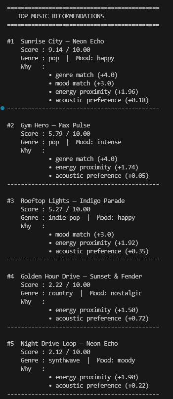
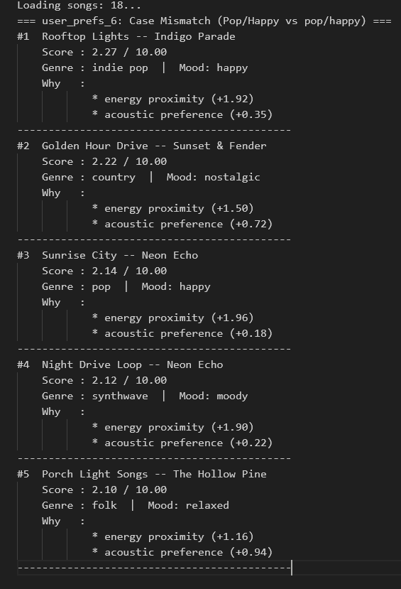
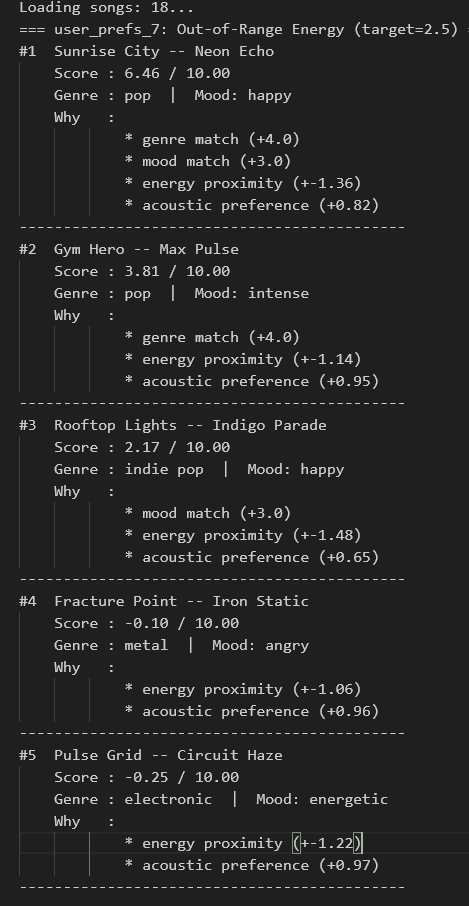
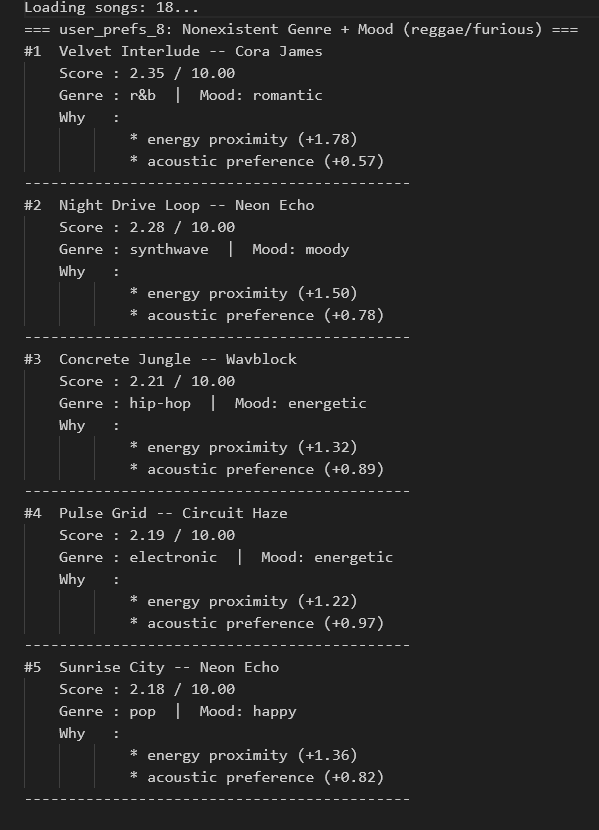
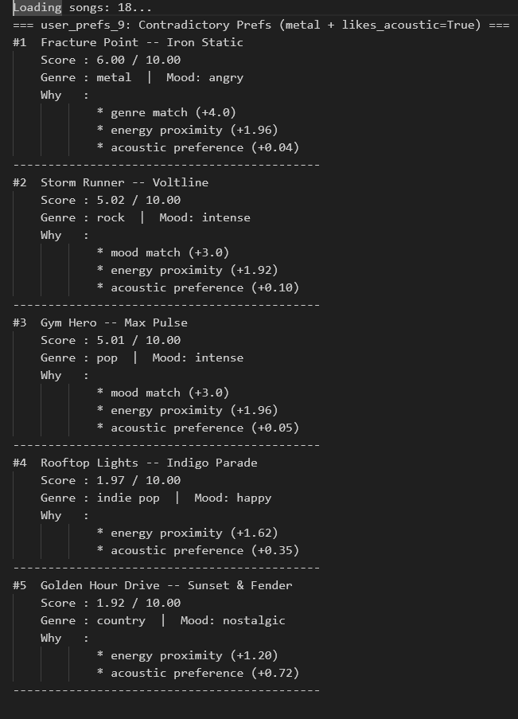
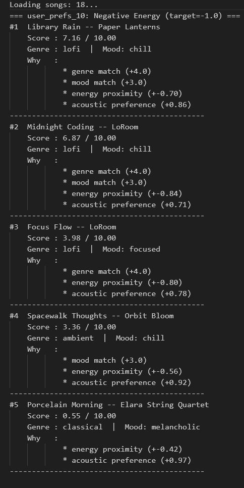
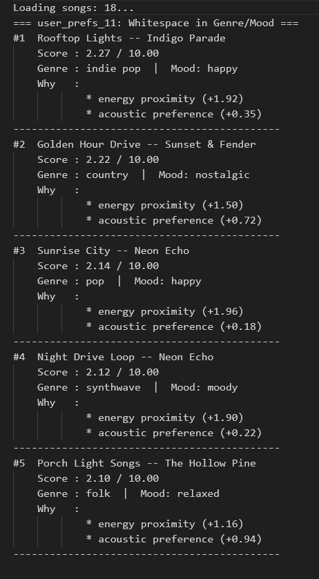
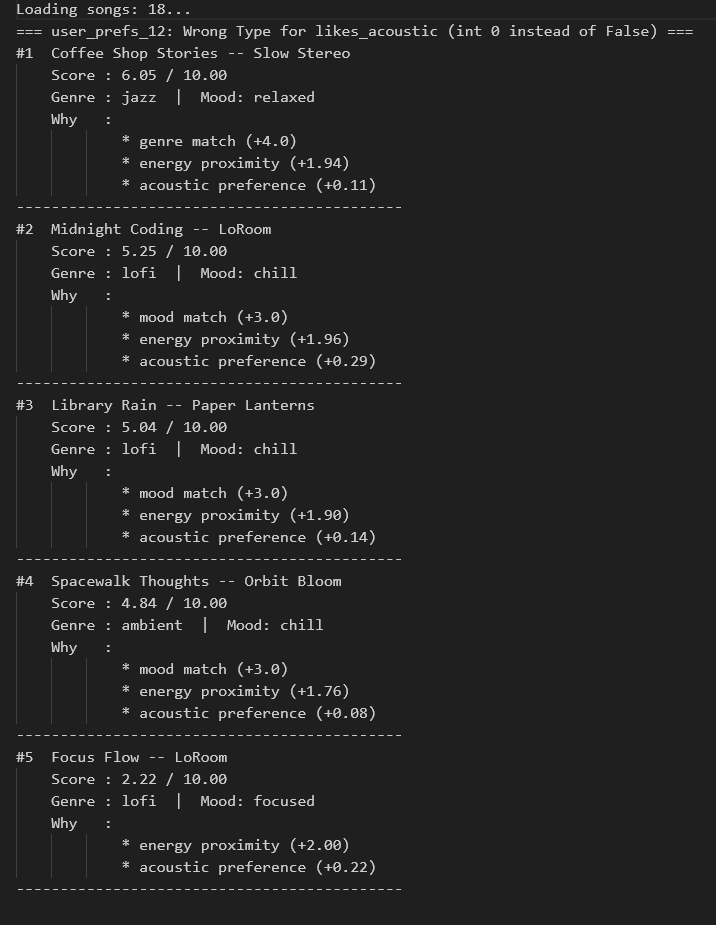
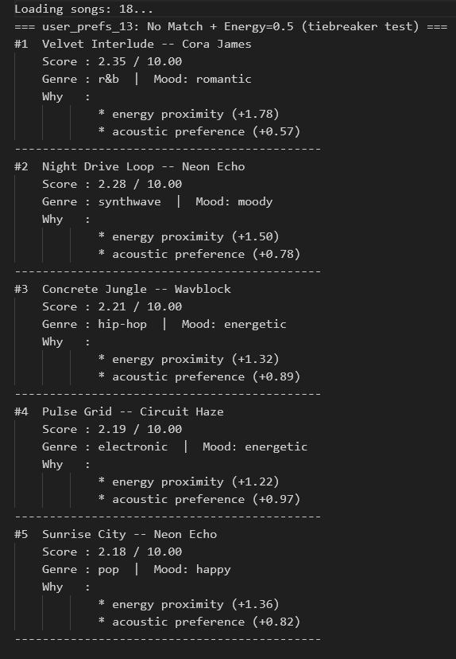

# 🎵 Music Recommender Simulation

## Project Summary

In this project you will build and explain a small music recommender system.

Your goal is to:

- Represent songs and a user "taste profile" as data
- Design a scoring rule that turns that data into recommendations
- Evaluate what your system gets right and wrong
- Reflect on how this mirrors real world AI recommenders

Replace this paragraph with your own summary of what your version does.

---

## How The System Works

Explain your design in plain language.

Some prompts to answer:

- What features does each `Song` use in your system
  -> For a "feel" of a song, genre + mood will be the features of a song used and for a more objective (numerical) measurement I'll be using energy + valence + danceability + acousticness.

- What information does your `UserProfile` store
  -> In the users profile data will be grouped into the two distinctions stated above. For "feel" there will be a favorite_genre and ""\_mood fields and for numerical scoring target_energy & likes_acoustic (boolean) will be used as measuring tools.

- How does your `Recommender` compute a score for each song
  -> Taking the distance between 1 and the users preference for energy will give the program a numerical score to each song.

- How do you choose which songs to recommend
  -> Taking the distance between user preference and song score will allow the program to score each song and matching the "feel" attributes to the stored users preferences will allow the program to rank the list of scored songs.

  Final algorithm:
  score = 0.0

         1. if song["genre"] == user_prefs["favorite_genre"]:
               score += 2.0

         2. if song["mood"] == user_prefs["favorite_mood"]:
               score += 1.5

         3. energy_delta = abs(song["energy"] - user_prefs["target_energy"])
            score -= energy_delta          # penalty: 0.0 (perfect) to –1.0 (worst)

         4. if user_prefs["likes_acoustic"] and song["acousticness"] > 0.5:
               score += 1.0

         → yield (song, score, explanation)
         Then sort descending by score, slice first k

  It has some biases against hip-hop genre as it scores well on genre but poorly on acoustic, chill/acousitc lofi songs will score well on mood + acoustic but miss on genre.

  Snap shot of default profile output:
  

---

## Getting Started

### Setup

1. Create a virtual environment (optional but recommended):

   ```bash
   python -m venv .venv
   source .venv/bin/activate      # Mac or Linux
   .venv\Scripts\activate         # Windows

   ```

2. Install dependencies

```bash
pip install -r requirements.txt
```

3. Run the app:

```bash
python -m src.main
```

### Running Tests

Run the starter tests with:

```bash
pytest
```

You can add more tests in `tests/test_recommender.py`.

---

## Example Users:

user_prefs_2 = {"favorite_genre": "hip-hop", "favorite_mood": "chill", "target_energy": 0.6, "likes_acoustic": False}

# Hip-hop users were served more low-energy songs on a consistent basis. This user was more driven by the target_energy I believe than the actual genre.

user_prefs_3 = {"favorite_genre": "blues", "favorite_mood": "relaxed", "target_energy": 0.5, "likes_acoustic": True}

# With the blues genre being more niche, a user with the blues preference will be recommended things more surrouding their mood preference.

user_prefs_4 = {"favorite_genre": "indie pop", "favorite_mood": "nostalgic", "target_energy": 0.7, "likes_acoustic": True}

# The indie-pop user was served 5 songs all with a differet genre. An indie-pop user will prefer songs that more match their energy and acoustic preferences.

user_prefs_5 = {"favorite_genre": "country", "favorite_mood": "happy", "target_energy": 0.6, "likes_acoustic": False}

# Country users are going to be more emerged in the music with feelings of nostalgia, happy, relaxed and even romantic!

## Outputs of Adversarial Profiles:

user_prefs_6 = {"favorite_genre": "Pop", "favorite_mood": "Happy", "target_energy": 0.8, "likes_acoustic": True}


# Energy above valid range: energy proximity formula produces negative contributions for all songs -->

    user_prefs_7 = {"favorite_genre": "pop", "favorite_mood": "happy", "target_energy": 2.5, "likes_acoustic": False}



# Nonexistent genre + mood: 0 pts for both — energy alone decides ranking, no warning shown

    user_prefs_8 = {"favorite_genre": "reggae", "favorite_mood": "furious", "target_energy": 0.5, "likes_acoustic": False}



# Contradictory preferences: metal genre match (+4) but likes_acoustic=True penalizes low-acoustic metal songs

    user_prefs_9 = {"favorite_genre": "metal", "favorite_mood": "intense", "target_energy": 0.95, "likes_acoustic": True}



# Negative energy: abs(song_energy - (-1.0)) always > 1.0, so energy always subtracts from score

    user_prefs_10 = {"favorite_genre": "lofi", "favorite_mood": "chill", "target_energy": -1.0, "likes_acoustic": True}



# Whitespace in strings: " pop" != "pop" — silent mismatch, genre score = 0

    user_prefs_11 = {"favorite_genre": " pop", "favorite_mood": "happy ", "target_energy": 0.8, "likes_acoustic": True}



# Integer instead of bool for likes_acoustic: Python duck-typing may handle 0/1, but no validation exists

    user_prefs_12 = {"favorite_genre": "jazz", "favorite_mood": "chill", "target_energy": 0.4, "likes_acoustic": 0}



# No genre/mood match + energy=0.5: many songs cluster near 0.5, ranking decided by sort stability

    user_prefs_13 = {"favorite_genre": "zzz_unknown", "favorite_mood": "zzz_unknown", "target_energy": 0.5, "likes_acoustic": False}



## Experiments You Tried

Use this section to document the experiments you ran. For example:

- What happened when you changed the weight on genre from 2.0 to 0.5
- What happened when you added tempo or valence to the score
- How did your system behave for different types of users

---

## Limitations and Risks

Summarize some limitations of your recommender.

Examples:

- It only works on a tiny catalog
- It does not understand lyrics or language
- It might over favor one genre or mood

You will go deeper on this in your model card.

---

## Reflection

Read and complete `model_card.md`:

[**Model Card**](model_card.md)

Write 1 to 2 paragraphs here about what you learned:

- about how recommenders turn data into predictions
- about where bias or unfairness could show up in systems like this

---

## 7. `model_card_template.md`

Combines reflection and model card framing from the Module 3 guidance. :contentReference[oaicite:2]{index=2}

```markdown
# 🎧 Model Card - Music Recommender Simulation

## 1. Model Name

Give your recommender a name, for example:

> VibeFinder 1.0

---

## 2. Intended Use

- What is this system trying to do
- Who is it for

Example:

> This model suggests 3 to 5 songs from a small catalog based on a user's preferred genre, mood, and energy level. It is for classroom exploration only, not for real users.

---

## 3. How It Works (Short Explanation)

Describe your scoring logic in plain language.

- What features of each song does it consider
- What information about the user does it use
- How does it turn those into a number

Try to avoid code in this section, treat it like an explanation to a non programmer.

---

## 4. Data

Describe your dataset.

- How many songs are in `data/songs.csv`
- Did you add or remove any songs
- What kinds of genres or moods are represented
- Whose taste does this data mostly reflect

---

## 5. Strengths

Where does your recommender work well

You can think about:

- Situations where the top results "felt right"
- Particular user profiles it served well
- Simplicity or transparency benefits

---

## 6. Limitations and Bias

Where does your recommender struggle

Some prompts:

- Does it ignore some genres or moods
- Does it treat all users as if they have the same taste shape
- Is it biased toward high energy or one genre by default
- How could this be unfair if used in a real product

---

## 7. Evaluation

How did you check your system

Examples:

- You tried multiple user profiles and wrote down whether the results matched your expectations
- You compared your simulation to what a real app like Spotify or YouTube tends to recommend
- You wrote tests for your scoring logic

You do not need a numeric metric, but if you used one, explain what it measures.

---

## 8. Future Work

If you had more time, how would you improve this recommender

Examples:

- Add support for multiple users and "group vibe" recommendations
- Balance diversity of songs instead of always picking the closest match
- Use more features, like tempo ranges or lyric themes

---

## 9. Personal Reflection

A few sentences about what you learned:

- What surprised you about how your system behaved
- How did building this change how you think about real music recommenders
- Where do you think human judgment still matters, even if the model seems "smart"
```
