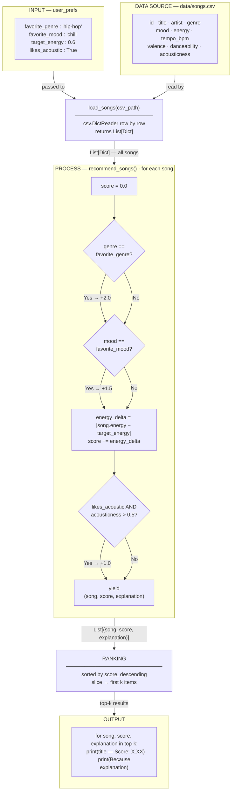

# Music Recommender — Data Flow

> Open **Markdown Preview** (`Ctrl+Shift+V`) to render the diagram.

```mermaid
flowchart TD
    subgraph INPUT["INPUT — user_prefs"]
        A["favorite_genre : 'hip-hop'\nfavorite_mood   : 'chill'\ntarget_energy   : 0.6\nlikes_acoustic  : True"]
    end

    subgraph CSV["DATA SOURCE — data/songs.csv"]
        B["id · title · artist · genre\nmood · energy · tempo_bpm\nvalence · danceability · acousticness"]
    end

    INPUT  -->|passed to| LOAD
    CSV    -->|read by  | LOAD

    LOAD["load_songs(csv_path)\n─────────────────────\ncsv.DictReader row by row\nreturns List[Dict]"]

    LOAD -->|"List[Dict] — all songs"| LOOP

    subgraph LOOP["PROCESS — recommend_songs() · for each song"]
        direction TB
        S0["score = 0.0"] --> G
        G{"genre ==\nfavorite_genre?"}
        G -->|"Yes  → +2.0"| M
        G -->|No             | M
        M{"mood ==\nfavorite_mood?"}
        M -->|"Yes  → +1.5"| E
        M -->|No             | E
        E["energy_delta = |song.energy − target_energy|\nscore −= energy_delta"]
        E --> AC
        AC{"likes_acoustic AND\nacousticness > 0.5?"}
        AC -->|"Yes  → +1.0"| R
        AC -->|No             | R
        R["yield\n(song, score, explanation)"]
    end

    LOOP -->|"List[(song, score, explanation)]"| RANK

    RANK["RANKING\n──────────────────────────\nsorted by score, descending\nslice → first k items"]

    RANK -->|"top-k results"| OUT

    subgraph OUT["OUTPUT"]
        P["for song, score, explanation in top-k:\n  print(title — Score: X.XX)\n  print(Because: explanation)"]
    end
```
